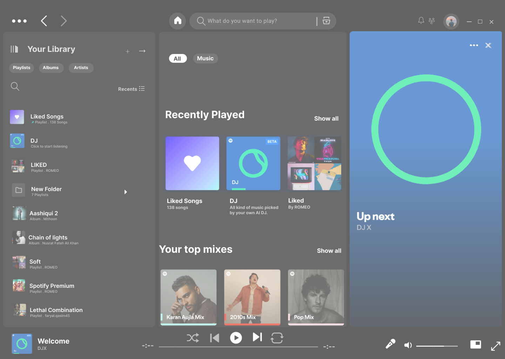

# 🎵 Spotify UI – Clone (Figma)

This project is a **1-page user interface replica** of Spotify, designed for learning and practicing UI/UX fundamentals. The purpose is to understand layout composition, spacing, visual hierarchy, and real-world design principles by recreating a well-known product.

---

## 🎯 Purpose

- Recreate a real-world UI (Spotify) to strengthen visual design and Figma prototyping skills.
- Focus on pixel-perfect alignment, color matching, and layout structure.
- Build a professional piece for UI/UX portfolio.

---

## 📷 Final Design Preview

| Spotify Clone (Main Page) |
|---------------------------|
|  |

> 🧪 Designed in Figma — includes sidebar, now playing bar, navigation, playlists, and album art sections.

---

## 🛠️ Tools Used

- **Figma** – UI Design & Prototyping  
- **Spotify Web App** – as visual reference

---

## 🔗 Live Design Prototype

👉 [View on Figma](https://www.figma.com/design/bsb5yEg5DcIS7Mw2yifXTS/Spotify-Replica?node-id=0-1&t=BqxFF01qFCV12HUI-1) 

---

## 🧠 What I Learned

- How to analyze and break down real-world UI layouts
- Practicing alignment, grouping, and color palettes
- Using Figma’s auto layout and component system
- Improving consistency and attention to visual details

---

## 🚀 Future Possibilities

- Expand this into a full multi-page Spotify UI replica
- Build a responsive version for mobile/tablet screens
- Recreate the same UI using Flutter or HTML/CSS for frontend

---

## 💬 Feedback

Feel free to give suggestions, fork the design, or contribute improvements!

---
